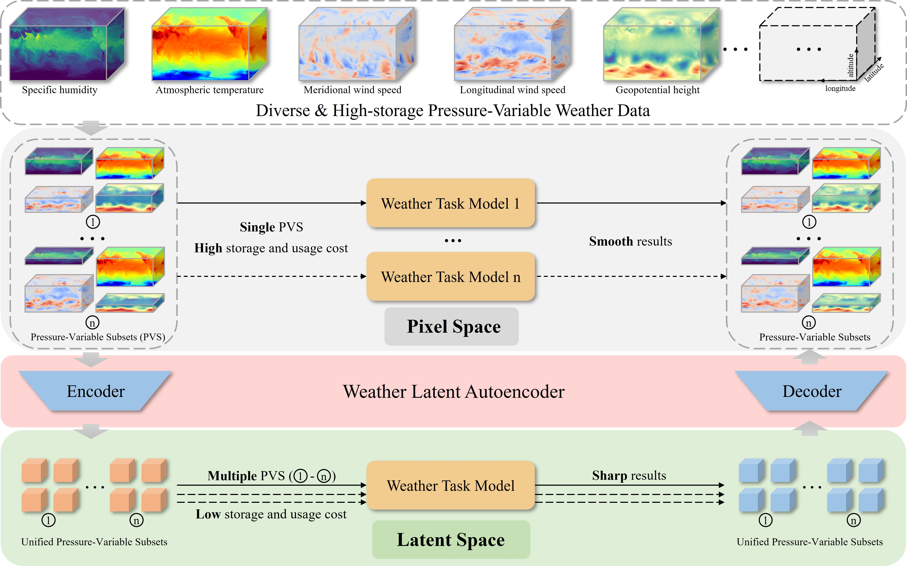

<div align="center">
    <h2>
        TransformingWeather Data from Pixel to Latent Space
    </h2>
</div>
<br>

<div align="center">
  
</div>
<br>
<div align="center">
  <!-- <a href="https://kychen.me/RSMamba">
    <span style="font-size: 20px; ">项目主页</span>
  </a>
       -->
  <a href="https://arxiv.org/abs/2503.06623">
    <span style="font-size: 20px; ">arXiv</span>
  </a>
      
  <a href="resources/weather_latent_autoencoder_arxiv.pdf">
    <span style="font-size: 20px; ">PDF</span>
  </a>
  <!--     
  <a href="https://huggingface.co/spaces/KyanChen/RSMamba">
    <span style="font-size: 20px; ">HFSpace</span>
  </a> -->
</div>
<br>
<br>

[](https://github.com/walking-shadow/Weather-Latent-Autoencoder)
[](LICENSE)
[](https://arxiv.org/abs/2503.06623)

<!-- [](https://huggingface.co/spaces/KyanChen/RSMamba) -->

<!-- <br>
<br> -->

<div align="center">

English | [简体中文](README_Chinese.md)

</div>

## Introduction

The repository for this project is the code implementation of the paper [TransformingWeather Data from Pixel to Latent Space](ARXIV).

If you find this project helpful, please give us a star ⭐️.

<details open>
<summary>Main Contribution</summary>

- We are the first to propose the novel idea of transforming
weather data from pixel space to latent space for weather
tasks. By transforming data into latent space, we decouple
weather reconstruction from the downstream tasks,
enabling the model to generate sharp and accurate results.
The unified representation of pressure levels and variables
allows task models to handle multiple pressure-variable
subsets, while the latent space framework significantly
reduces data storage and computational costs.

- We introduce the Weather Latent Autoencoder for the
pixel-to-latent transformation of weather data. WLA can
effectively transform any pressure-variable subset from
pixel space to a unified latent space, providing excellent
compression and reconstruction performance. This allows
weather task models to operate in latent space, achieving
high accuracy with low data cost across multiple pressurevariable
subsets.

- We have constructed the ERA5-latent dataset, which
provides large-scale ERA5 weather data with multiple
pressure-variable subsets in a smaller data storage footprint
and unified latent space. This transformation reduces the data costs of original ERA5 data, offering a robust
data foundation for broader meteorological research


</details>

## Updates

<!-- 🌟 **2024.03.29** Released the RS-Mamba project

🌟 **2024.03.29** Released the code of models and training framwork -->

## TODO

- [X] Open source the model code
- [] Open source the training code
- [] Open source the pretrained model
- [] Open source the Era5-latent dataset


## Citation

If you are using this project's code or performance benchmarks in your research, please refer to bibtex to reference RSMamba below.

```
@misc{zhao2025transformingweatherdatapixel,
      title={Transforming Weather Data from Pixel to Latent Space}, 
      author={Sijie Zhao and Feng Liu and Xueliang Zhang and Hao Chen and Tao Han and Junchao Gong and Ran Tao and Pengfeng Xiao and Lei Bai and Wanli Ouyang},
      year={2025},
      eprint={2503.06623},
      archivePrefix={arXiv},
      primaryClass={cs.CV},
      url={https://arxiv.org/abs/2503.06623}, 
}
```

## License

This project is licensed under the [Apache 2.0 License](LICENSE)。
